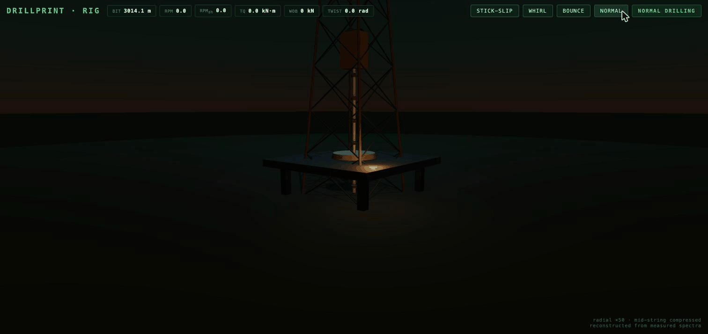
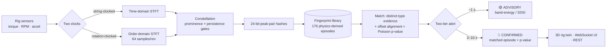

# DRILLPRINT

**Shazam for drilling failures — deterministic, explainable, physics-grounded, real-time.**

<p align="center">
  
</p>
<p align="center"><sub><i>Real footage, real engine: every alert in this recording came from the live detection
pipeline during capture — amber advisory in under a second, red confirmation with the matched
library episode named in the feed.</i></sub></p>

<p align="center">
  
  
  
  
</p>

---

## What is this?

Shazam recognizes a song from a noisy bar recording by reducing audio to a sparse
constellation of spectral peaks and matching hashed peak-pairs against a library.

**DrillPrint does the same thing to drilling rigs.** Downhole dysfunctions — the vibration
failures that destroy drill bits and cost rig-days — have *predictable spectral signatures*
derived from first principles:

| Dysfunction | What physically happens | Signature | Clocked by |
|---|---|---|---|
| **Stick-slip** | Bit sticks, pipe winds up like a torsion spring, whips free | Harmonic comb at f₀ ≈ c/4L | *String length* |
| **Bit whirl** | Bit rolls around the borehole wall like a gear in a ring | Line at order N_blades+1 | *Rotation speed* |
| **Bit bounce** | Bit hammers a three-lobed hole bottom | Lines at orders 3, 6, 9 | *Rotation speed* |

Because whirl and bounce frequencies move with RPM, DrillPrint resamples those signals
**per revolution instead of per second** (the *order domain*) — so a fingerprint taken at
80 RPM still matches at 140 RPM. That dual-domain trick is the core contribution:
**no training data, no ML, no generalization gap.** Deploying to a new well means
recomputing physics priors, not collecting labeled failures. Every alert decomposes into
an auditable chain: samples → spectra → peaks → hashes → aligned matches → probability.

## How it works



The library itself is **generated from physics** — a 2-DOF Stribeck stick-slip model
integrated with SciPy, whirl/bounce kinematics synthesized from blade-count relations —
swept across string lengths, RPMs, and severities (135 stick-slip corners + 27 whirl +
9 bounce + healthy-baseline episodes that absorb false positives).

## Quickstart (5 minutes)

Requires Python 3.11+ ([`uv`](https://docs.astral.sh/uv/) recommended, plain `pip` works too).

```bash
git clone <this-repo> && cd DRILLPRINT
uv venv .venv && uv pip install --python .venv/bin/python numpy scipy fastapi "uvicorn[standard]" websockets typer pyyaml pytest httpx
```

**1. Prove it works** (121 tests, ~1 min):

```bash
.venv/bin/python -m pytest
```

**2. Build the fingerprint library from physics** (~30 s), then approve & activate it —
libraries go through explicit change-control (built → validated → approved) before they can go live:

```bash
.venv/bin/python -m synth.build_library --db data/library.db --version v1
```

```bash
.venv/bin/python -c "
from store.fingerprint_db import FingerprintDB
db = FingerprintDB('data/library.db')
db.set_status('v1','validated'); db.set_status('v1','approved',approved_by='me'); db.activate('v1')
print('active:', db.active_version())"
```

**3. Launch the platform:**

```bash
.venv/bin/python cli.py demo
```

Then open **http://localhost:8000/rig.html** — the 3D rig view. Press **WHIRL** and watch:
the string spins, an amber advisory fires in under a second, and a few seconds later the red
**CONFIRMED** card names the exact library episode that matched. **NORMAL** shows the calm
baseline (and proves the pump-noise comb doesn't fool it). The React monitor dashboard lives
at **http://localhost:8000/**, and the full REST/WebSocket API is self-documented at
**http://localhost:8000/docs**.

## Measured performance

Full benchmark protocol: 10 composite runs × 4 noise levels, every run containing all three
dysfunctions between healthy separators, scored against a calibrated band-energy baseline
(the honest incumbent). Regenerate everything with one command.

| Detection (recall / median latency) | SNR 20 dB | 10 dB | 3 dB | **0 dB** |
|---|---|---|---|---|
| **Bit bounce** | 100% / 3.0 s | 100% / 3.0 s | 100% / 3.4 s | **100% / 3.6 s** |
| **Whirl** | 100% / 3.0 s | 100% / 3.0 s | 100% / 3.2 s | **100% / 3.4 s** |
| **Stick-slip** | 90% / 78 s | ⚠ degraded | ⚠ degraded | ⚠ degraded |
| *Baseline (best of any class)* | *90% w/ 21 FA/h* | *30% w/ 127 FA/h* | *10%* | *0%* |

False alerts: bounce **0–0.4/hour**, whirl **0.4–1.1/hour**, at every noise level — while the
baseline detector is either blind or firing dozens of false alarms per hour. The rotation-clocked
classes hold **perfect recall at 0 dB SNR** — the "noisy bar" claim, measured. Stick-slip is
strong at realistic torque-channel SNR and degrades honestly below 10 dB (its harmonic comb is
physically erased by in-band noise — a characterized limit, not a bug; the amber SSSI advisory
tier still covers it).

```bash
.venv/bin/python -m bench.run --smoke   # ~8 min sanity run
.venv/bin/python -m bench.run --full    # full protocol (hours; results → bench/report.json)
```

## Repository map

```
engine/     pure DSP core — STFT, peaks, hashing, matcher, order domain, twin kinematics
synth/      physics generators (stick-slip ODE, whirl, bounce, normal) + treatments
store/      SQLite fingerprint store, library versioning + approval state machine
ingest/     ring buffers, gap policy, channel alignment, the streaming detection pipeline
api/        FastAPI app — REST + /ws/ingest + /ws/monitor (5 message types)
replay/     stream player (replay and live hit the identical code path)
bench/      benchmark protocol, scoring, calibrated baseline
frontend_dist/  monitor dashboard + rig.html (3D twin, Three.js, self-contained)
tests/      121 tests — every acceptance gate and every forensic regression
```

## Documentation

- [`DRILLPRINT_SPEC_v1.3.md`](DRILLPRINT_SPEC_v1.3.md) — the full technical specification (physics → math → architecture)
- [`ERRATA_v1.3.md`](ERRATA_v1.3.md) — the engineering log: eight forensic cycles (E1–E8b) in which
  the benchmark was made honest and each fix exposed the next masked defect. Read this to
  understand *why* the detector is trustworthy.
- [`SPEC_STUDY.md`](SPEC_STUDY.md) — the 40-finding verification study that hardened the spec before implementation
- [`bench/report.json`](bench/report.json) — the current measured scorecard (regenerable)

## Honest limitations

- **Stick-slip below 10 dB SNR**: the fingerprint carrier (harmonic ladder) is physically
  buried; Tier-1 advisories carry that regime. Documented in the errata.
- **Synthetic + replayed data**: field validation on Volve WITSML logs is scaffolded but
  gated on dataset licensing (never bundled; see spec §13).
- The subterranean camera work in the 3D twin needs interior lighting polish.

---

*Author: Johnpaul Okeke · spec v1.3*
